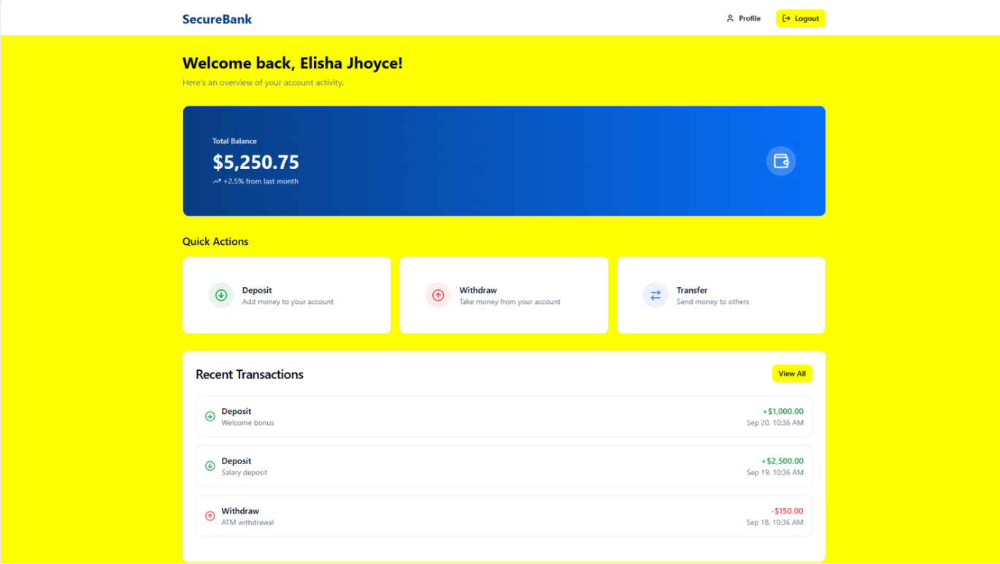

🏦 Banking System UI

This project is a Banking System User Interface that demonstrates the core functionalities of a simple yet modern banking application. The UI design ensures a smooth, intuitive, and user-friendly experience, following good UI/UX principles.

📌 Features

- Create Account Page – Allows new users to register and create an account.
- Dashboard Page – Displays an overview of user account details and recent activities.
- Deposit Money Page – Enables users to deposit funds into their account.
- Withdraw Money Page – Provides functionality for cash withdrawals.
- Transfer Money Page – Allows secure fund transfers between accouns.
- Transaction History Page – Shows a detailed history of transaction.
- My Profile Page – Lets users view and update their personal account details.

🚀 Tech Stack
- Design Principles: Clean layouts, intuitive navigation, and responsive design

# 🏦 Banking System UI

